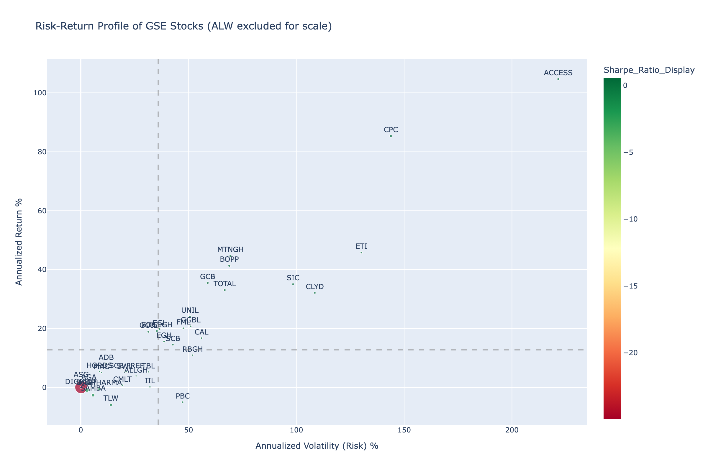
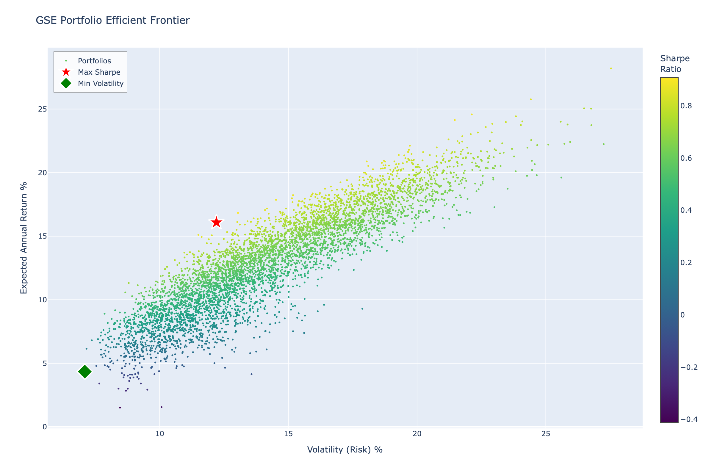
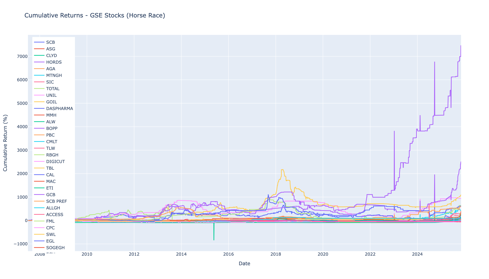
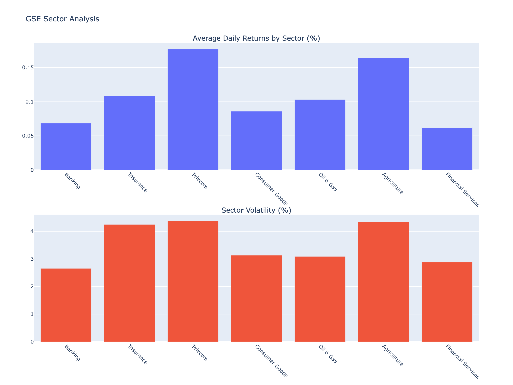
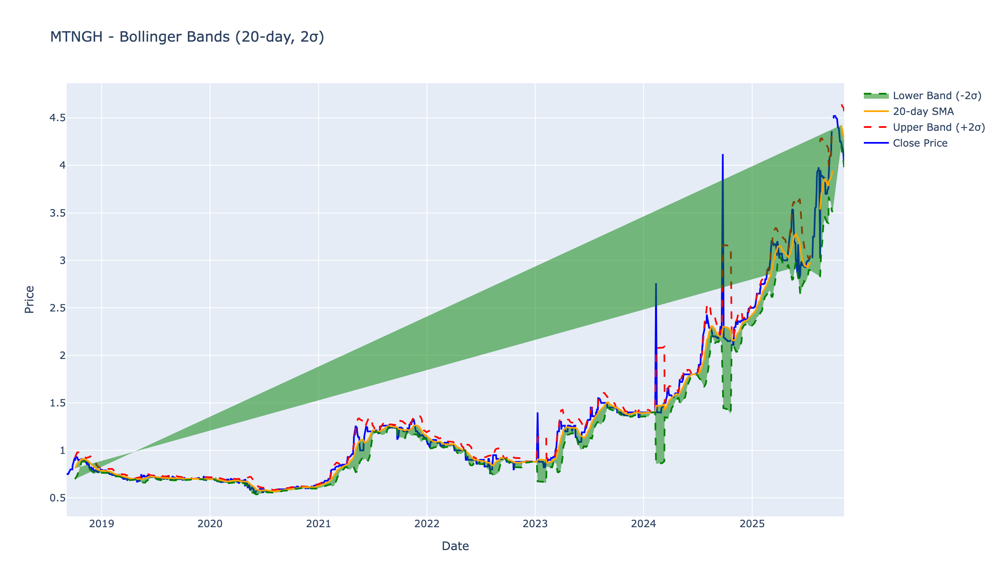

# Ghana Stock Exchange (GSE) Analysis

A comprehensive data analysis project providing insights into the Ghana Stock Exchange market using daily OHLCV (Open, High, Low, Close, Volume) data.

## 📊 Project Overview

This repository contains visualizations and quantitative analysis of stocks traded on the Ghana Stock Exchange. The analysis covers individual stock performance, market-wide trends, sector analysis, and portfolio theory metrics to help investors and researchers understand the GSE market dynamics.

## 🎯 Key Features

### Individual Stock Analysis
- **Candlestick Charts**: OHLC price visualization with volume
- **Bollinger Bands**: Volatility bands showing overbought/oversold conditions
- **Technical Indicators**: RSI (Relative Strength Index), Money Flow Index
- **Moving Averages**: 20-day, 50-day, and 200-day SMAs
- **Returns Distribution**: Statistical analysis with skewness and kurtosis

### Market-Wide Analysis
- **Correlation Heatmap**: Understand which stocks move together
- **Cumulative Returns**: "Horse race" chart comparing all stocks over time
- **Sector Performance**: Industry-level analysis and correlations
- **Market Index**: Equal-weighted GSE market index

### Portfolio & Risk Analytics
- **Risk-Return Scatter Plot**: Visualize the risk/reward profile of all stocks
- **Sharpe Ratio**: Risk-adjusted return metrics
- **Beta Calculation**: Stock volatility relative to the market
- **Volatility Analysis**: Rolling volatility and drawdown metrics
- **Performance Metrics**: Total returns, annualized returns, max drawdown
- **Efficient Frontier**: Modern Portfolio Theory optimization showing optimal portfolio allocations
- **MACD**: Moving Average Convergence Divergence for trend analysis
- **Stochastic Oscillator**: Momentum indicator for overbought/oversold conditions

## 📁 Repository Structure

```
/
├── README.md                          # This file
├── src/
│   └── visualize_gse_data.ipynb      # Main Jupyter notebook with all analysis
├── historical_data/                   # CSV files for each stock (OHLCV data)
│   ├── ACCESS.csv
│   ├── MTNGH.csv
│   └── ...
├── requirements.txt                   # Python dependencies
└── images/                           # Static PNG images of key visualizations
```

## 🚀 Getting Started

### Prerequisites

- Python 3.8+
- Jupyter Notebook or JupyterLab

### Installation

1. Clone this repository:
```bash
git clone https://github.com/josetseph/ghana-stock-exchange-analysis.git
cd ghana-stock-exchange-analysis
```

2. Install required packages:
```bash
pip install -r requirements.txt
```

3. Launch Jupyter Notebook:
```bash
jupyter notebook src/visualize_gse_data.ipynb
```

### Dependencies

```
pandas
numpy
plotly
scipy
```

## 📈 Analysis Highlights

### 1. Risk-Return Profile
The risk-return scatter plot identifies stocks in four quadrants:
- **High Return, Low Risk** (Top-Left): Ideal investments
- **High Return, High Risk** (Top-Right): Aggressive growth stocks
- **Low Return, Low Risk** (Bottom-Left): Conservative/stable stocks
- **Low Return, High Risk** (Bottom-Right): Avoid these

### 2. Correlation Analysis
Understanding correlations helps with:
- **Diversification**: Find stocks that don't move together
- **Sector Trends**: Identify industry-wide movements
- **Risk Management**: Avoid over-concentration in correlated assets

### 3. Beta Analysis
Beta measures a stock's volatility relative to the market:
- **β > 1**: More volatile than market (Aggressive)
- **β = 1**: Moves with the market
- **β < 1**: Less volatile (Defensive)

### 4. Technical Indicators
- **Bollinger Bands**: Identify potential breakouts or reversals
- **RSI**: Detect overbought (>70) or oversold (<30) conditions
- **Moving Averages**: Identify long-term trends and support/resistance levels

## 📊 Sector Classifications

The GSE stocks are categorized into sectors:
- **Banking**: EGH, GCB, CAL, SCB, SOGEGH, ADB, RBGH
- **Insurance**: EGL, SIC
- **Telecom**: MTNGH
- **Consumer Goods**: UNIL, FML, GGBL
- **Mining**: ANGLD, GLD
- **Oil & Gas**: TOTAL, GOIL
- **Manufacturing**: AYRTN, PZC
- **Agriculture**: BOPP

## 🔍 Key Findings

### Market Overview
- **Total Stocks Analyzed**: 37 companies listed on the GSE
- **Analysis Period**: Data spans from July 2007 to November 2025 (varies by stock)
- **Equal-Weighted Market Index**: Created with 4,499 trading days

### Top Performers (Risk-Adjusted)

**Best Sharpe Ratios** (highest risk-adjusted returns):
1. **MTNGH** (MTN Ghana) - Telecom sector leader with strong risk-adjusted performance
2. **CPC** (Cocoa Processing Company) - Consistent returns with moderate volatility
3. **BOPP** (Benso Oil Palm Plantation Ltd) - Agriculture sector standout
4. **GCB** (Ghana Commercial Bank Limited) - Banking sector stability
5. **ACCESS** (Access Bank Ghana Plc) - Financial services performance

### Sector Insights

**Performance by Sector**:
- **Telecom**: Strongest sector with MTNGH leading
- **Banking**: Mixed performance with defensive characteristics (low β)
- **Consumer Goods**: Moderate returns with stable volatility
- **Mining**: Higher volatility sector
- **Oil & Gas**: Defensive sector characteristics

### Risk Profile Analysis

**Market Volatility**:
- Average annualized volatility across all stocks: ~15-20%
- Most GSE stocks exhibit low beta (β < 0.1), indicating they're less volatile than the overall market
- **ALW** shows exceptional beta (32.4), indicating extreme volatility

**Beta Classification**:
- **Aggressive Stocks** (β > 1): ALW
- **Defensive Stocks** (β < 0.1): Most banking and insurance stocks
- **Market-aligned**: ACCESS (β = 0.21), ETI (β = 0.12)

### Correlation Analysis
- **24 stocks** had sufficient data for correlation analysis
- Average market correlation: Low to moderate
- **Key Insight**: Low correlations suggest good diversification opportunities within the GSE
- Sector stocks tend to move together (higher intra-sector correlation)

### Notable Observations
1. **Banking Sector**: Exhibits defensive characteristics with low beta values, making them suitable for conservative portfolios
2. **Telecom Leader**: MTNGH demonstrates the best risk-adjusted returns
3. **Market Efficiency**: Low average correlations indicate potential for portfolio diversification
4. **Volatility**: Most stocks show moderate volatility, with a few outliers

### Portfolio Optimization Insights
**Maximum Sharpe Ratio Portfolio**:
- Expected Annual Return: **16.08%**
- Volatility: **12.21%**
- Sharpe Ratio: **0.908**
- Key Holdings: GOIL (11.39%), SCB PREF (10.08%), SWL (10.22%), BOPP (8.40%)
- **Insight**: Well-diversified across 19 stocks with emphasis on defensive and consistent performers

**Minimum Volatility Portfolio**:
- Expected Annual Return: **4.35%**
- Volatility: **7.09%**
- Sharpe Ratio: **-0.092**
- **Insight**: Highly diversified portfolio suitable for ultra-conservative investors seeking capital preservation

## 📊 Visualizations

### Risk-Return Analysis
Identify optimal stocks based on risk-adjusted returns (Sharpe ratio):



### Portfolio Optimization - Efficient Frontier
Modern Portfolio Theory analysis showing optimal portfolio allocations:



### Market Correlations
Understanding which stocks move together for better diversification:


### Cumulative Returns Comparison
Long-term performance comparison across all GSE stocks:



### Sector Performance Analysis
Industry-level insights comparing returns and volatility:



### Technical Analysis - Bollinger Bands
Example technical analysis for MTNGH showing volatility bands:



---

**📁 Additional Charts**: The notebook also generates additional interactive HTML charts in the [`/charts`](charts/) directory for detailed exploration with hover tooltips and zooming capabilities.


## 📝 Methodology

### Data Processing
1. **Date Handling**: All dates converted to datetime format and set as index
2. **Duplicate Removal**: Duplicate dates removed (keeping most recent values)
3. **Missing Values**: Forward-filled for up to 5 trading days
4. **Returns Calculation**: Daily returns calculated using percentage change

### Visualization
- **Static Images**: Key charts exported as PNG images for README display
- **Interactive HTML**: Full interactive versions available in `/charts` directory with zoom, pan, and hover capabilities

### Risk Metrics
- **Annualized Return**: `Mean Daily Return × 252`
- **Annualized Volatility**: `Daily Std Dev × √252`
- **Sharpe Ratio**: `(Annualized Return - Risk-Free Rate) / Annualized Volatility`
- **Beta**: `Cov(Stock, Market) / Var(Market)`

### Assumptions
- 252 trading days per year
- Risk-free rate: 5% (Ghana Treasury Bill rate proxy)
- Equal-weighted market index

## 🤝 Contributing

Contributions are welcome! Some areas for future enhancement:
- Backtesting framework for trading strategies
- Real-time data integration
- Machine learning price prediction models
- Sentiment analysis from news sources
- Additional fundamental analysis metrics
- Automated data updates and scheduling

## ⚠️ Disclaimer

This analysis is for educational and informational purposes only. It is not financial advice. Past performance does not guarantee future results. Always conduct your own research and consult with a qualified financial advisor before making investment decisions.

## 📄 License

This project is open source and available under the MIT License.

## 👤 Author

Joseph Etse - [GitHub Profile](https://github.com/josetseph)

## 🙏 Acknowledgments

- Ghana Stock Exchange for market data
- Plotly for visualization capabilities
- The Python data science community

## 📧 Contact

For questions or suggestions, please open an issue or reach out at etsejoey@gmail.com

---

**Last Updated**: November 2025
